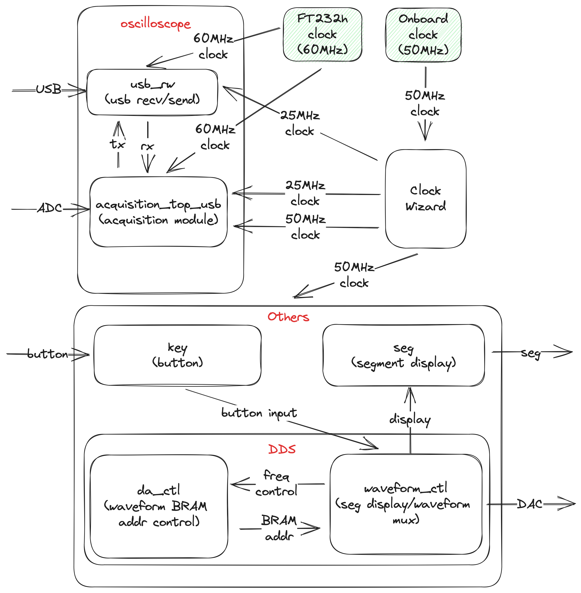
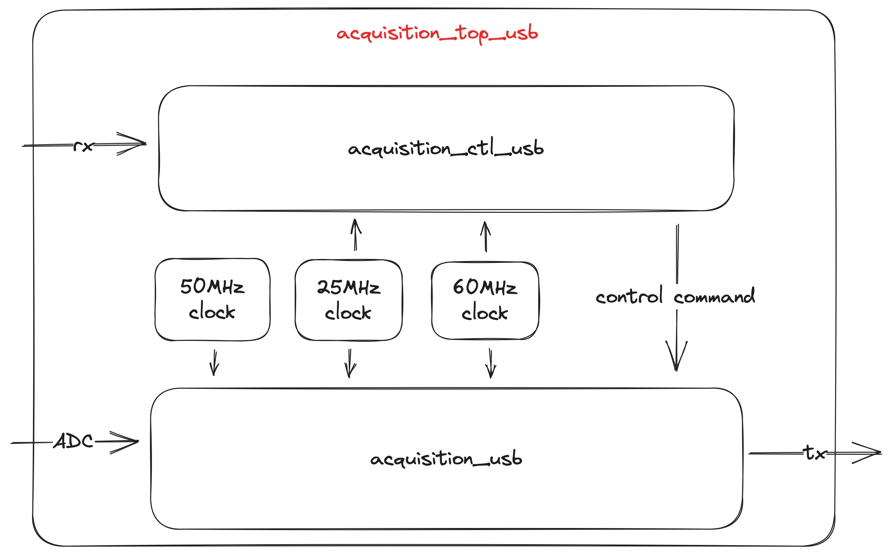

# ada

Ada is a Xilinx® Artix™ 7 based dual channel oscilloscope.

This is a project that I completed within three weeks. Although it may not be high-profile, it can still meet some basic requirements.

For GUI, please refer to https://github.com/Sped0n/lovelace.

## Structure

### Top module

### Acquisition top module

### Acquisition module

